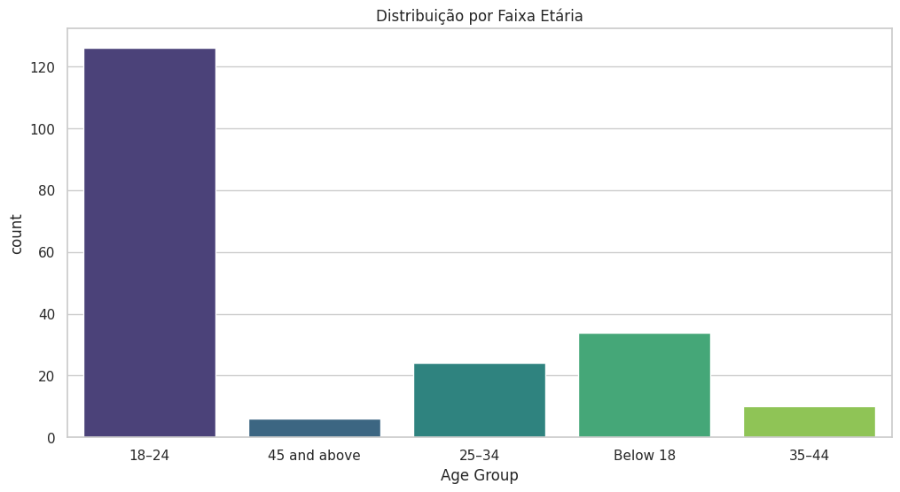
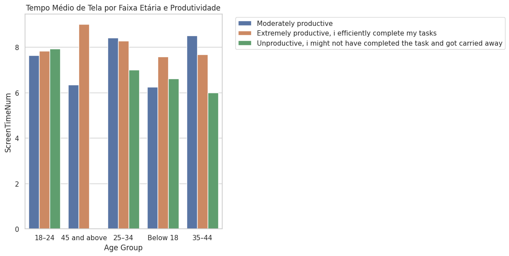

# Análise de Produtividade vs. Tempo de Tela e Uso de Aplicativos

Este repositório contém a análise de dados e o código-fonte do artigo **"O impacto do tempo de tela e uso de aplicativos móveis: uma análise de variáveis comportamentais e produtividade"**.

## 🎯 Objetivo

A pesquisa investiga os efeitos do uso prolongado de telas na produtividade, foco e bem-estar digital de jovens adultos. Utilizando uma abordagem quantitativa, o projeto analisa dados de 200 participantes para identificar padrões entre o comportamento digital e o desempenho cognitivo e profissional.

## 📊 Dataset

A análise foi realizada a partir do conjunto de dados *Screen Time Data: Productivity and Attention Span*, disponibilizado na plataforma Kaggle.

* **Fonte:** [Kaggle - Screen Time Data](https://www.kaggle.com/datasets/muhammadalirazazaidi/screen-time-data-productivity-and-attention-span)
* **Amostra:** 200 participantes
* **Período:** Dados coletados entre 2023 e 2024

## 💡 Principais Conclusões do Estudo

A análise dos dados, detalhada no artigo, revelou os seguintes insights:

1.  **Perfil Dominante:** A maioria dos participantes são homens, estudantes de graduação, com idade entre 18 e 24 anos.
2.  **Tempo de Tela:** O tempo de exposição diária a telas concentra-se principalmente nas faixas de **4 a 6 horas** e **6 a 8 horas**, indicando um uso intenso e regular de dispositivos digitais.
3.  **Uso de Aplicativos:** **Redes Sociais** são a categoria de aplicativo mais utilizada, seguidas por aplicativos de **Produtividade**. Isso demonstra um uso multifuncional da tecnologia, tanto para lazer quanto para trabalho/estudo.
4.  **Impacto na Produtividade:** O uso excessivo de telas está associado a uma produtividade percebida como apenas **moderada** pela maioria dos adultos, frequentemente afetada por distrações digitais.
5.  **Relevância Cognitiva:** Os achados corroboram a literatura que aponta prejuízos na concentração e sintomas semelhantes ao TDAH em crianças devido ao uso excessivo de telas.

Em suma, embora as tecnologias digitais ofereçam benefícios, seu uso indiscriminado exige intervenções para mitigar impactos negativos no desempenho profissional e no bem-estar digital.

## 📈 Visualizações em Destaque

<p align="center">
  
  
</p>

## 🛠️ Ferramentas e Bibliotecas

* **Linguagem:** Python
* **Bibliotecas:** Pandas, Matplotlib, Seaborn, Plotly
* **Ambiente:** Jupyter Notebook

## 🚀 Como Reproduzir a Análise

Para executar este projeto localmente, siga os passos abaixo:

1.  **Clone este repositório:**
    ```bash
    git clone [https://github.com/telesvfx/analise-tempo-de-tela.git](https://github.com/telesvfx/analise-tempo-de-tela.git)
    cd analise-tempo-de-tela
    ```

2.  **Instale as dependências:**
    ```bash
    pip install -r requirements.txt
    ```

3.  **Execute o Notebook:**
    Abra e execute o notebook Jupyter localizado em `analysis/Screen_Time_PI.ipynb`.

## 📄 Artigo e Autores

📄 **[Clique aqui para ler o artigo completo em PDF](./docs/Artigo_Tempo_de_Tela_Ciencia_de_Dados.pdf)**

O trabalho científico, com a metodologia e a discussão detalhada dos resultados, foi desenvolvido por:

* Felipe Tavares
* Paulo Futagawa
* Thiago Teles Silva

Sob a orientação da Prof.ª Estefania Angélico Pianoski Arata, para o curso de Ciência de Dados para Negócios da FATEC Sebrae (Junho de 2025).